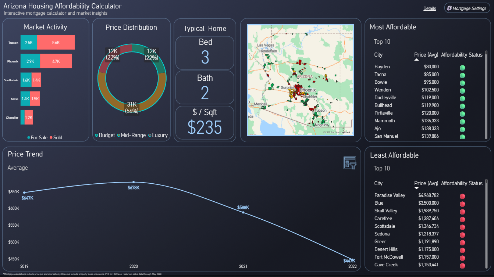
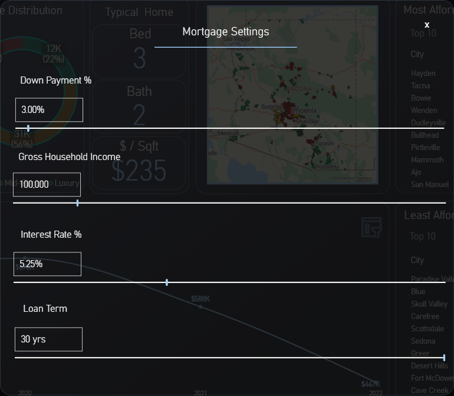
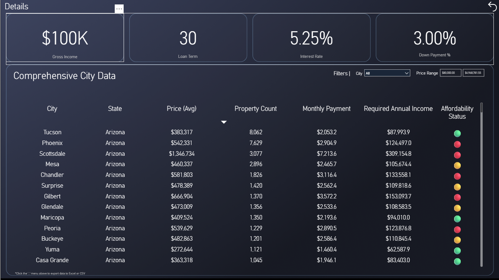

# Arizona Housing Affordability Calculator

An interactive Power BI dashboard that helps first-time homebuyers assess housing affordability across Arizona cities using real mortgage calculations and market data.



## 🎯 Project Overview

This end-to-end business intelligence project analyzes 55,626 property listings across 213 Arizona cities to provide actionable insights into housing affordability. Users can adjust mortgage parameters (down payment, interest rate, loan term, income) to see which cities are affordable based on the 28% rule used by mortgage lenders.

### Key Features

- **Interactive Mortgage Calculator** with collapsible settings panel
- **Dynamic Affordability Assessment** using industry-standard 28% income rule
- **Geographic Visualization** with color-coded affordability map
- **Historical Price Trends** with filterable date ranges
- **Comprehensive Data Export** for detailed analysis
- **Multi-page Dashboard** with overview and detailed data views

## 📊 Dashboard Components

### Page 1: Main Dashboard

- **Market Activity**: For sale vs sold status by city
- **Price Distribution**: Budget/Mid-Range/Luxury breakdown
- **Typical Home Features**: Average beds, baths, and price per sqft
- **Interactive Map**: ArcGIS visualization with geocoded coordinates
- **Top 10 Tables**: Most and least affordable cities
- **Price Trends**: Historical sales data (2020-2022)

### Page 2: Detailed Data Export

- **Comprehensive City Table**: All metrics for 213 cities
- **Interactive Filters**: City and price range slicers
- **Export Functionality**: Download to Excel or CSV

## 🛠️ Technologies Used

- **Python 3.x**: Data cleaning and transformation
- **Pandas**: Data manipulation
- **GeoPy**: Geocoding API integration
- **SQLite**: Database management
- **SQL**: Complex queries and views
- **Power BI Desktop**: Interactive dashboard
- **DAX**: Advanced calculations and measures
- **ArcGIS Maps**: Geographic visualization

## 📁 Project Structure

```
phoenix-housing-analysis/
├── data/
│   ├── raw/                          # Original dataset
│   └── cleaned/                      # Processed data
├── database/
│   └── real_estate.db               # SQLite database
├── sql/
│   └── views.sql                    # 5 analytical views
├── scripts/
│   ├── 01_data_cleaning.py          # Python cleaning script
│   ├── 02_create_database.py        # Database setup
│   ├── 03_load_data.py              # Data loading
│   ├── 04_export_views_to_csv.py    # Export for Power BI
│   └── 05_add_coordinates.py        # Geocoding script
├── powerbi/
│   ├── data/                        # CSV exports from SQL
│   ├── assets/                      # Dashboard backgrounds
│   └── arizona_housing_dashboard.pbix
├── screenshots/                     # Dashboard images
│   ├── main_dashboard.png
│   ├── settings_panel.png
│   └── details_page.png
└── README.md
```

## 🚀 How to Run

### Prerequisites

```bash
pip install pandas geopy
```

### Step 1: Data Cleaning

```bash
python scripts/01_data_cleaning.py
```

Cleans 55,626 property records, handles missing values, standardizes formats.

### Step 2: Database Setup

```bash
python scripts/02_create_database.py
python scripts/03_load_data.py
```

Creates SQLite database with optimized schema.

### Step 3: Create SQL Views

Run `sql/views.sql` to create 5 analytical views:

- `avg_price_by_city`
- `city_property_features`
- `price_category_by_city`
- `status_by_city`
- `sales_by_month_year`

### Step 4: Geocode & Export

```bash
python scripts/04_export_views_to_csv.py
python scripts/05_add_coordinates.py
```

### Step 5: Open Power BI Dashboard

Open `powerbi/arizona_housing_dashboard.pbix` in Power BI Desktop.

## 📐 Technical Highlights

### DAX Calculations

**Monthly Payment Calculation** (Standard Mortgage Formula):

```dax
Monthly Payment =
VAR HomePrice = SELECTEDVALUE(avg_price_by_city[avg_price])
VAR DownPaymentPct = SELECTEDVALUE('Down Payment %'[Down Payment %])
VAR InterestRate = SELECTEDVALUE('Interest Rate %'[Interest Rate %])
VAR LoanTermYears = SELECTEDVALUE('Loan Term (Years)'[Loan Term (Years)])
VAR LoanAmount = HomePrice * (1 - DownPaymentPct)
VAR MonthlyRate = InterestRate / 12
VAR NumPayments = LoanTermYears * 12
RETURN
IF(
    MonthlyRate = 0,
    LoanAmount / NumPayments,
    LoanAmount * (MonthlyRate * POWER(1 + MonthlyRate, NumPayments)) /
    (POWER(1 + MonthlyRate, NumPayments) - 1)
)
```

**Affordability Assessment** (28% Rule):

```dax
Affordability Status =
VAR RequiredIncome = [Required Annual Income]
VAR UserIncome = SELECTEDVALUE('Your Gross Household Income'[Your Gross Household Income])
VAR Ratio = RequiredIncome / UserIncome
RETURN
SWITCH(
    TRUE(),
    Ratio <= 1, "🟢",
    Ratio <= 1.15, "🟡",
    "🔴"
)
```

### Data Model

- **Denormalized approach** using SQL views for simplified Power BI integration
- **One-to-many relationship** between `avg_price_by_city` and `sales_by_month_year`
- **Single-direction cross-filtering** to prevent ambiguous filter contexts
- **What-if parameters** synced across pages for consistent mortgage calculations

## 📈 Key Insights

- **12K (22%)** properties are budget-friendly (<$300K)
- **31K (56%)** properties fall in mid-range ($300K-$750K)
- **12K (22%)** properties are luxury (>$750K)
- **Average Arizona home**: 3 beds, 2 baths, 1,850 sqft, $235/sqft
- **Most affordable city**: Hayden at $80,000 average
- **Price trends**: Decline from 2020-2022 peak

## ⚠️ Limitations & Future Enhancements

### Current Limitations

- Calculations include **principal and interest only** (excludes property tax, insurance, PMI, HOA)
- Historical data through **May 2022** (static dataset)
- Arizona-specific analysis

### Planned Enhancements

- [ ] Implement **live data feeds** via real estate APIs (Realtor.com, Realty Mole)
- [ ] Refactor to **star schema** with proper fact/dimension tables for better performance
- [ ] Add **full PITI calculation** (property tax, insurance, PMI, HOA fees)
- [ ] Expand to **multi-state analysis**
- [ ] Add **predictive analytics** for price forecasting

## 🎓 Skills Demonstrated

- End-to-end ETL pipeline development
- SQL database design and optimization
- Complex DAX measure creation
- Interactive dashboard design (bookmarks, parameters, navigation)
- Geographic data visualization with API integration
- Data modeling and relationship management
- Business problem solving and domain knowledge
- Professional presentation and documentation

## 📸 Screenshots

### Main Dashboard


### Mortgage Settings Panel



### Details Page



## 👤 Author

**Nicholas Giunta**

- Email: 1ngiunta2@gmail.com
- LinkedIn: [linkedin.com/in/ngiunta1](https://www.linkedin.com/in/ngiunta1/)
- Portfolio: [ngiunta1.github.io/portfolio](https://ngiunta1.github.io/portfolio/)

## 📄 License

This project is for portfolio demonstration purposes.

## 🙏 Acknowledgments

- Dataset sourced from public real estate listings
- Geocoding powered by OpenStreetMap via GeoPy
- ArcGIS Maps for Power BI visualization
